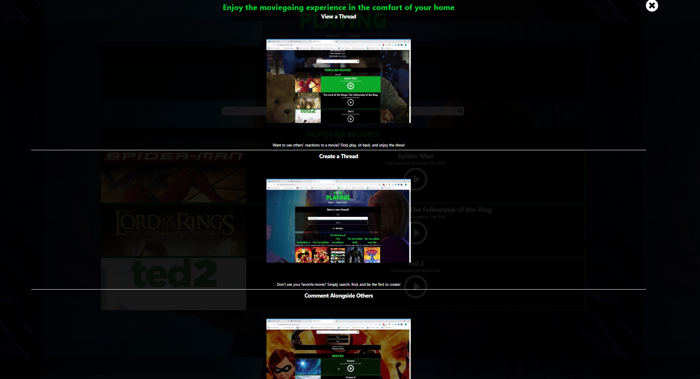
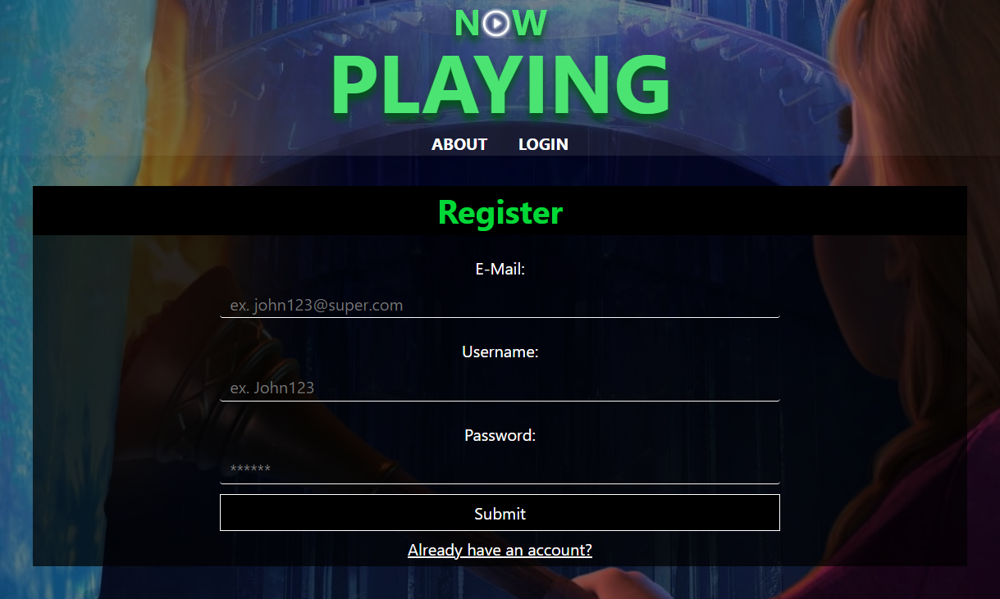
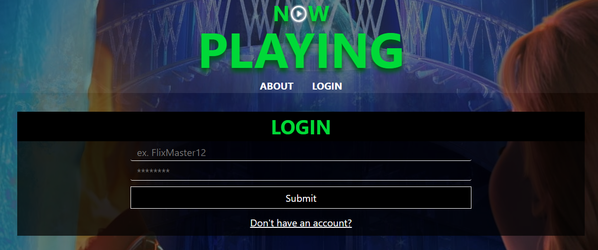
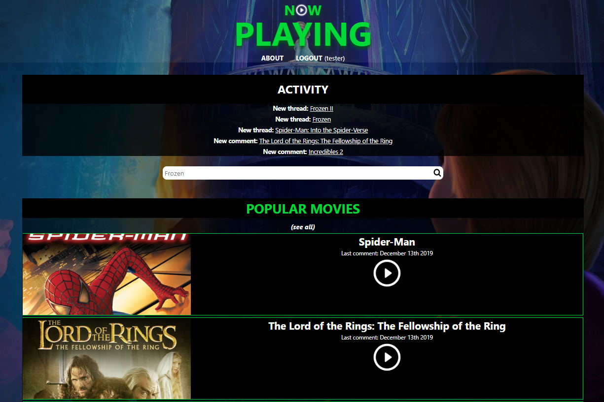
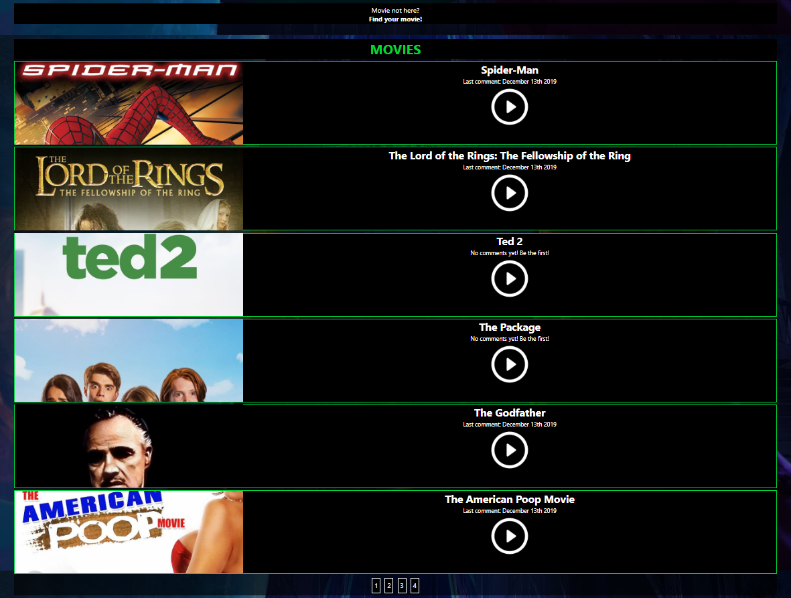
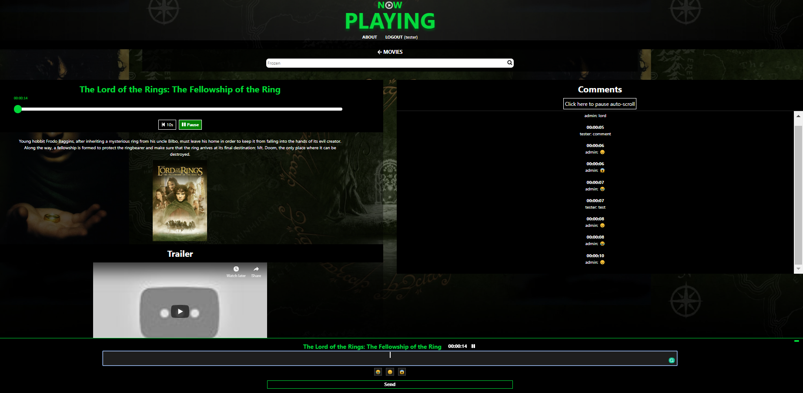
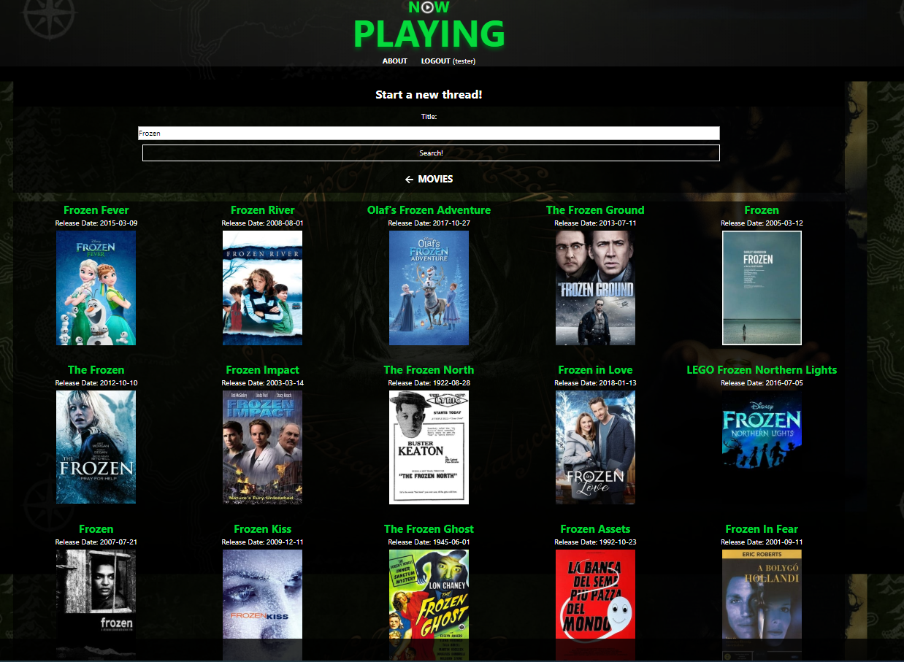
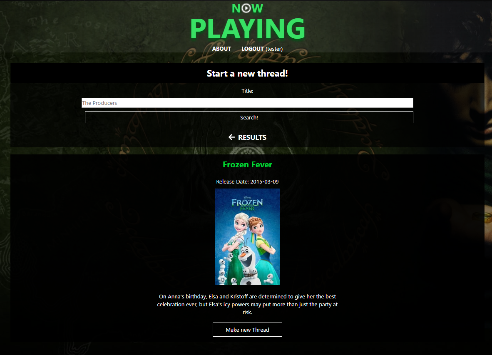

# Now Playing
* Live version: https://playing-phi-ten.now.sh/
  * Demo username: tester
  * Demo password: Password1!
* Live link to API endpoints: https://murmuring-lowlands-61113.herokuapp.com/api

* Link to Server Repo: https://github.com/thinkful-ei-gecko/NowPlaying-server
* Link to Client Repo: https://github.com/thinkful-ei-gecko/NowPlaying-Client


## Contributors to Repository:
* EJ Gonzalez
* Leon Dail
* Marlon Agno
* Preet Singh
* William Bae
  
  
## Getting Started
* Clone the repository and install dependencies using ```npm install```
* Start the development server using ```npm start```
* Run tests using Jest & Enzyme using ```npm test```
  
  
## Description
Now Playing is a React application that provides users a platform to engage with a live audience when watching movies. Users are able to view movie threads and see comments made from the community. Additionally, they can create new threads and comment alongside others in real-time. Now Playing utilizes the TMDb API to offer a large breadth of movies that users can search and create new threads from.


## TMDb API Endpoint
* Link to TMDb API: https://www.themoviedb.org/documentation/api

* ```GET /movie/{movie_id}``` : Returns an object of a specific movie's details
* ```GET /movie/{movie_id}/videos``` : Returns an object of a specific movie's video details (This was used to obtain the "key", which allowed us to query for a given movie's YouTube trailer)
* ```GET /search``` : Returns relevant movie titles based on the user's search input


## Screenshots
#### Landing Page


#### Registration Page (Once user successfully creates an account they are directed to Login page)


#### Login Page (Once user successfully logs in they are directed to the Home or Landing page)


#### Home Page


#### Category Page


#### Thread Page


#### Create New Thread Page (Fields are populated with data grabbed from TMDb API)




#### Technologies
* HTML5
* CSS3
* ReactJS
  * React Compound Slider
  * React Player
  * React Scroll